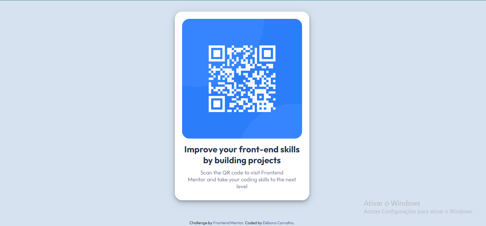

# QR-code-component
Criação de uma página estática com html+css para o Frontend Mentor
# Frontend Mentor - QR code component solution

This is a solution to the [QR code component challenge on Frontend Mentor](https://www.frontendmentor.io/challenges/qr-code-component-iux_sIO_H). Frontend Mentor challenges help you improve your coding skills by building realistic projects. 

## Table of contents

- [Overview](#overview)
  - [Screenshot](#screenshot)
  - [Links](#links)
  - [Built with](#built-with)
- [Author](#author)

## Overview

### Screenshot

### Links

- Solution URL:(https://github.com/DeboraCristinaP/QR-code-component)

### Built with

- Semantic HTML5 markup
- CSS custom properties
- Flexbox

## Author

- Website - [Débora Carvalho](https://github.com/DeboraCristinaP/QR-code-component)
- Frontend Mentor - [@yourusername](https://www.frontendmentor.io/profile/DeboraCristinaP)
